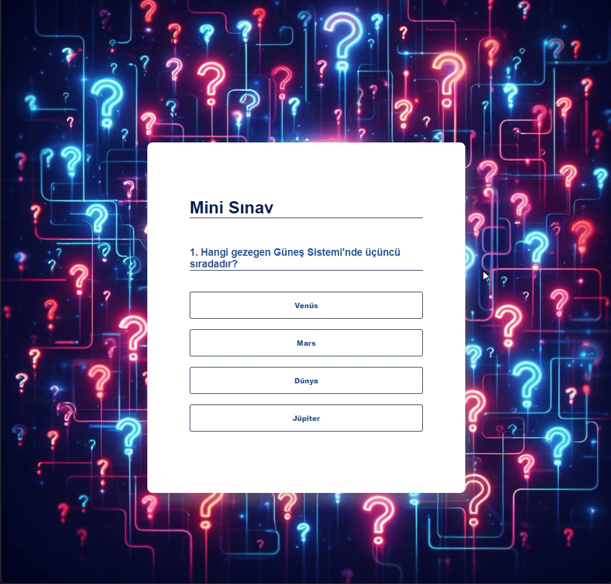

# E-Ticaret Sitesi

Bu Django tabanlı e-ticaret sitesi, kullanıcıların giriş yapmasını, ürün eklemesini ve arama yaparak ürünleri listelemesini sağlar. Bootstrap kullanılarak geliştirilmiştir.

## Özellikler

1. **Giriş Yapma:**
   - Kullanıcılar, kullanıcı adı ve şifreleriyle sisteme giriş yapabilirler.

2. **Ürün Ekleme:**
   - Giriş yapan kullanıcılar, ürün bilgilerini ekleyerek mağazaya ürün ekleyebilirler.

3. **Arama Yapma:**
   - Ana sayfada bulunan arama çubuğuna kelime yazarak, ilgili ürünleri listeleyebilirler.

4. **Ürünleri Listeleyebilme:**
   - Arama sonuçları ve mağazadaki tüm ürünler, sayfa üzerinde liste halinde gösterilir.

5. **Kullanıcı Çıkışı:**
   - Kullanıcılar, hesaplarından çıkış yapabilirler.

## Teknolojiler

- Django
